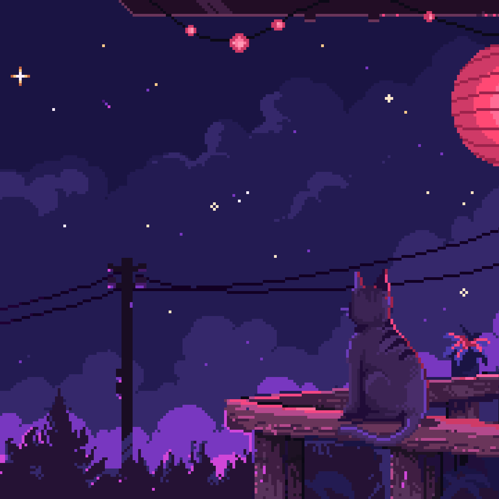

<!-- BANNER SUPERIOR (Centrado) -->

  

  

<!-- TÍTULO ANIMADO DE BIENVENIDA (Centrado) -->

  
  
  

  

## Acerca de mí

¡Hola! Soy **Zula**, un desarrollador con experiencia en **desarrollo web, móvil y de escritorio**. Me gusta explorar diferentes lenguajes y frameworks como **Java, Angular, .NET, Python y más**, siempre buscando aprender nuevas tecnologías y mejorar mis habilidades.  

Actualmente estoy aprendiendo **Electron y las APIs de Google** para ampliar mis conocimientos en el desarrollo de aplicaciones integradas con servicios en la nube.  

### Más allá del código:  
Cuando no estoy programando, me gusta **entrenar en el gimnasio, seguir el mercado de criptomonedas y el trading, jugar a videojuegos, ver anime y pasar el tiempo con mis amigos**.

  

## 🛠️ Tecnologías y Herramientas

<!-- GIF flotando a la derecha, con tamaño fijo (por ejemplo, 300px) -->

### Lenguajes de programación que manejo

  
  
  
  
  
  
  
  
  
  
  

### Aprendiendo actualmente

  
  
  

### Frameworks y librerías que manejo

  
  
  

### Bases de datos que manejo

  
  
  

### Herramientas

  
  
  
  

### IDEs y entornos de desarrollo

  
  
  
  
  

### APIs con las que he trabajado

  
  
  
  

  

## Estadísticas de GitHub

  
  

        

  

  

## Conecta conmigo

  
  

